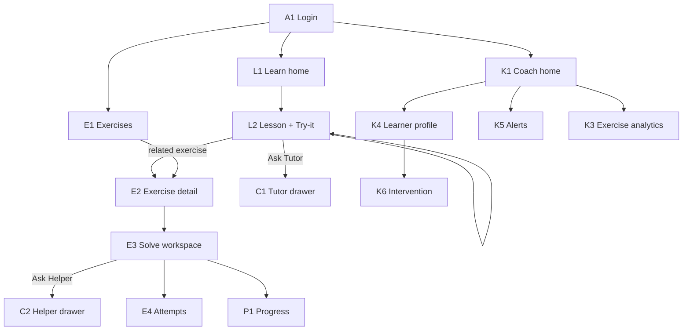

# EduCoach JS — Screen list + wireframe outline

**Program:** 2-week JavaScript  
**Docs UX:** W3Schools *pattern* (sidebar + lesson + Try-it + Prev/Next), **not** a W3 visual clone  
**Content:** adapted from an open JS tutorial  
**Runners:** browser Try-it / exercises now · Node later  

---

## 0. App shell (all logged-in screens)

```
┌──────────────────────────────────────────────────────────────────┐
│  EduCoach JS          Learn   Exercises   [Coach*]   Progress    │
│                                              [avatar ▾] Logout   │
├──────────────────────────────────────────────────────────────────┤
│                                                                  │
│                        (page content)                            │
│                                                                  │
└──────────────────────────────────────────────────────────────────┘
* Coach tab only if role = coach
```

**Top nav**
| Item | Learner | Coach |
|------|---------|-------|
| Learn | ✓ | ✓ (preview curriculum) |
| Exercises | ✓ | ✓ (with analytics) |
| Coach | — | ✓ |
| Progress | own | class overview shortcut |
| Account menu | profile, logout | same |

---

## 1. Screen inventory

### Auth
| ID | Screen | Who |
|----|--------|-----|
| A1 | Login | all |
| A2 | (Optional later) Forgot password / invite accept | all |

### Learner — Learn
| ID | Screen | Purpose |
|----|--------|---------|
| L1 | Learn home (Week 1 / Week 2) | Pick day, see % done |
| L2 | Lesson reader | W3-pattern lesson + Try-it |
| L3 | Docs search results | Find a lesson |
| L4 | Bookmarks | Saved lessons |

### Learner — Exercises
| ID | Screen | Purpose |
|----|--------|---------|
| E1 | Exercise catalog | Filter by day/topic/status |
| E2 | Exercise detail | Statement, links to lesson, start |
| E3 | Solve workspace | Editor + Run + tests + AI help |
| E4 | Attempt history | Past submissions for one exercise |

### Learner — Progress / shared
| ID | Screen | Purpose |
|----|--------|---------|
| P1 | My progress | Docs %, exercises %, current day |
| C1 | Tutor chat drawer | Concept help (from lesson or exercise) |
| C2 | Helper chat drawer | Hints-only coding help |

### Coach
| ID | Screen | Purpose |
|----|--------|---------|
| K1 | Coach home / risk board | Who needs help today |
| K2 | Class progress | Week 1/2 completion matrix |
| K3 | Exercise analytics | Fail rates, avg attempts |
| K4 | Learner profile | One student deep-dive |
| K5 | Alerts inbox | `coach_alert` side channel |
| K6 | Intervention | Unlock hint/solution, leave note |

### MVP priority (build first)
`A1 → L1 → L2 → E1 → E2 → E3 → P1 → K1 → K5 → C1/C2`  
Later: L3, L4, E4, K2–K4, K6, Node runner.

---

## 2. Learn wireframes

### L1 — Learn home

```
┌──────────────────────────────────────────────────────────────────┐
│  EduCoach JS     Learn   Exercises   Progress          [you ▾]   │
├──────────────────────────────────────────────────────────────────┤
│  2-week JavaScript                                               │
│  Week 1 ●●●●○  72%          Week 2 ○○○○○  0%                     │
│                                                                  │
│  ┌─ Week 1 ───────────────────────────────────────────────────┐  │
│  │ Day 1  Variables & types          ████████░░  lessons 4/5  │  │
│  │ Day 2  Operators & strings        ██░░░░░░░░  lessons 1/4  │  │
│  │ Day 3  Conditionals & loops       ░░░░░░░░░░  not started  │  │
│  │ ...                                                        │  │
│  └────────────────────────────────────────────────────────────┘  │
│                                                                  │
│  Continue → Day 2 · Lesson “Template literals”                   │
└──────────────────────────────────────────────────────────────────┘
```

**Actions:** open day → first incomplete lesson; jump to Exercises for that day.

---

### L2 — Lesson reader (core W3 pattern, your brand)

```
┌──────────────────────────────────────────────────────────────────┐
│  EduCoach JS     Learn   Exercises   Progress          [you ▾]   │
├────────────┬─────────────────────────────────────────────────────┤
│ CURRICULUM │  Day 2 · Operators & strings                        │
│            │  Template literals                          [★] [?] │
│ Week 1     │─────────────────────────────────────────────────────│
│  Day 1     │  Short intro (2–4 sentences).                       │
│  Day 2 ◀   │                                                      │
│   · Strings│  ## Rules                                            │
│   · Templ… │  • Use backticks ` `                                 │
│   · …      │  • ${expression} inside                              │
│  Day 3     │                                                      │
│ Week 2     │  ## Example                                          │
│  …         │  ┌─────────────────────────────────────────────┐   │
│            │  │  const name = "Ada";                        │   │
│ [Search]   │  │  console.log(`Hi ${name}`);                 │   │
│            │  └─────────────────────────────────────────────┘   │
│            │                                                      │
│            │  ## Try it yourself                                  │
│            │  ┌─ editor ─────────────┬─ output ─────────────┐   │
│            │  │  (editable JS)       │  Hi Ada              │   │
│            │  │                      │                      │   │
│            │  └──────────────────────┴──────────────────────┘   │
│            │  [ Run ]  [ Reset ]     Ask Tutor about this page   │
│            │                                                      │
│            │  [ ← Prev ]                         [ Next → ]       │
│            │  Related exercise: E-204 “Greet with template”      │
└────────────┴─────────────────────────────────────────────────────┘
```

**Must-have behaviors**
- Sidebar highlights current lesson; collapse Week 1 / 2.
- Try-it runs **in the browser** (no Node yet).
- Prev/Next follow curriculum order.
- “Ask Tutor” opens **C1** with this lesson as RAG context.
- Link to related exercise → **E2**.
- Optional callouts: tip / common mistake (your brand styling).

---

### L3 — Search (outline only)

```
│  Search docs: [ array map____________ ] [Search]                 │
│  Results                                                             │
│  · Arrays · map          Day 5     “Transform each item…”            │
│  · Objects · keys        Day 5     …                                 │
```

---

## 3. Exercise wireframes

### E1 — Exercise catalog

```
┌──────────────────────────────────────────────────────────────────┐
│  Exercises                                                           │
│  Filters: [Day ▾] [Topic ▾] [Status ▾]     Search [..........]       │
├──────────────────────────────────────────────────────────────────────┤
│  Day 2                                                               │
│  ○ E-201  String length check         Easy     Not started           │
│  ● E-204  Greet with template         Easy     In progress           │
│  ✓ E-205  Fix the concatenation       Easy     Passed                │
│  Day 3                                                               │
│  ○ E-301  Fizz filter                 Medium   Locked*               │
└──────────────────────────────────────────────────────────────────────┘
* Lock optional in MVP; can show all as available.
```

---

### E2 — Exercise detail

```
┌──────────────────────────────────────────────────────────────────┐
│  ← Catalog     E-204  Greet with template           Easy · Day 2     │
├──────────────────────────────────────────────────────────────────────┤
│  Goal                                                                │
│  Write a function `greet(name)` that returns `Hi, <name>!`           │
│  using a template literal.                                           │
│                                                                      │
│  Constraints: no string concatenation with +.                        │
│                                                                      │
│  Read first:  [Lesson · Template literals]                           │
│                                                                      │
│  Status: In progress · 2 attempts                                    │
│                                                                      │
│  [ Start / Continue solving ]     [ View attempt history ]           │
└──────────────────────────────────────────────────────────────────────┘
```

---

### E3 — Solve workspace (core practice screen)

```
┌──────────────────────────────────────────────────────────────────┐
│  E-204 Greet with template          [Hints 1/3] [Ask Helper]       │
├──────────────────────────────────┬───────────────────────────────────┤
│  Instructions (sticky)           │  Editor                           │
│  Return `Hi, ${name}!`           │  function greet(name) {           │
│  …                               │    // your code                   │
│                                  │  }                                │
│  Visible tests                   │                                   │
│  ✓ greet("Ada") → Hi, Ada!       │  [ Run tests ]  [ Reset ]         │
│  ✗ greet("") → …                 │                                   │
│                                  ├─ Results ─────────────────────────┤
│  Docs shortcut                   │  2 passed · 1 failed              │
│  [Open lesson]                   │  Expected "Hi, !" got "Hi, "      │
└──────────────────────────────────┴───────────────────────────────────┘
│  [ Submit attempt ]                                                  │
└──────────────────────────────────────────────────────────────────────┘
```

**Behaviors**
- Run tests in **browser** sandbox (timeout, no network).
- Hints ladder: reveal next hint only (never full solution in MVP).
- **Ask Helper** → **C2** with exercise statement + last code + failing tests.
- Submit stores snapshot + results → feeds Progress + Coach analytics.
- Pass → celebration toast + Next exercise / Back to catalog.

---

### E4 — Attempt history (outline)

```
│  Attempt #3  today 14:02   2/3 tests   [View code]                   │
│  Attempt #2  today 13:40   1/3 tests                                 │
│  Attempt #1  yesterday     0/3 tests                                 │
```

---

## 4. AI drawers (shared)

### C1 — Tutor (from lesson)

```
┌─ Tutor ─────────────────────────────┐
│  Context: Lesson “Template literals”│
│─────────────────────────────────────│
│  You: What does ${} do?             │
│  Tutor: … (cites lesson title)      │
│─────────────────────────────────────│
│  [ Type a question…          Send ] │
└─────────────────────────────────────┘
```

### C2 — Helper (from exercise)

```
┌─ Code Helper ───────────────────────┐
│  Context: E-204 · 1 test failing    │
│  Mode: hints only — no full solution│
│─────────────────────────────────────│
│  Helper: Check empty string case…   │
│─────────────────────────────────────│
│  [ Ask for a hint…           Send ] │
└─────────────────────────────────────┘
```

**Product rule:** learner UI shows **`reply` only**. Risk / coach text never appears here.

---

## 5. Progress (learner)

### P1 — My progress

```
┌──────────────────────────────────────────────────────────────────┐
│  My progress · Week 1 of 2                                           │
│  Docs  ████████░░  68%     Exercises  ████░░░░░░  40%                │
│                                                                      │
│  Today’s path                                                        │
│  1. Finish lesson “Template literals”     [Continue]                 │
│  2. Pass E-204                            [Solve]                    │
│  3. Start Day 3 intro                     [Learn]                    │
└──────────────────────────────────────────────────────────────────────┘
```

---

## 6. Coach wireframes

### K1 — Coach home / risk board

```
┌──────────────────────────────────────────────────────────────────┐
│  Coach · Today                                                       │
│  At-risk: 5    Behind on docs: 3    Failing E-204: 8                 │
├──────────────────────────────────────────────────────────────────────┤
│  Student      Day   Docs%  Ex%   Pred. score   Flag      Action      │
│  student07    2     40%    20%   7.2           AT-RISK   [Open]      │
│  student12    2     55%    35%   9.1           watch     [Open]      │
│  student03    3     80%    70%   14.0          ok        [Open]      │
│  …                                                                   │
├──────────────────────────────────────────────────────────────────────┤
│  Alerts (latest)                                                     │
│  · student07 predicted at-risk after E-204 fails ×4     2m ago       │
└──────────────────────────────────────────────────────────────────────┘
```

---

### K2 — Class progress (matrix outline)

```
│         D1  D2  D3  D4  D5  |  D6 …                                  │
│  s01    ✓   ✓   ●   ○   ○                                            │
│  s07    ✓   ●   ○   ○   ○                                            │
│  legend: ✓ day done · ● in progress · ○ not started                  │
```

---

### K3 — Exercise analytics (outline)

```
│  E-204  Greet with template                                          │
│  Pass rate 42%   Avg attempts 3.1   Median time 18m                  │
│  Top fail: empty-string test                                         │
```

---

### K4 — Learner profile

```
┌──────────────────────────────────────────────────────────────────┐
│  student07 · Day 2 · AT-RISK                                         │
│  Docs 40% · Exercises 20% · Last seen 10m ago                        │
│                                                                      │
│  Weak topics: strings, template literals                             │
│  Recent fails: E-204 ×4                                              │
│  Alerts: …                                                           │
│                                                                      │
│  [Unlock next hint] [Unlock solution] [Leave note] [Open as learner] │
└──────────────────────────────────────────────────────────────────────┘
```

---

### K5 — Alerts inbox

```
│  ● student07  at-risk · low solves + E-204 fails           14:02     │
│  ○ student12  watch · 3 fails on E-201                     13:40     │
│  (coach-only — never shown in learner chat)                          │
```

---

### K6 — Intervention (modal / side panel)

```
│  Unlock hint #2 for student07 on E-204?                              │
│  Note to student (optional): “Relis la leçon Template literals.”     │
│  [Cancel]  [Confirm]                                                 │
```

---

## 7. Navigation map



---

## 8. Learner happy path (one sitting)

1. Login → **P1** or **L1** “Continue”.  
2. Read lesson on **L2**, Run Try-it.  
3. Optional: Ask Tutor (**C1**).  
4. Open related exercise **E2** → **E3**.  
5. Run tests, use hints / Helper (**C2**), Submit.  
6. Progress updates; if struggling, coach sees **K1/K5** — learner never sees the alert.

---

## 9. Design notes (not a W3 clone)

- Own brand: typography, color tokens, spacing — teaching-clear, not green-W3 nostalgia.  
- Same **information architecture** as W3: sidebar · lesson · try-it · next.  
- Prefer one primary CTA per screen (Continue / Run / Submit).  
- Coach UI denser (tables); learner UI calmer (one path).

---

## 10. Next doc (when you want)

- **10-day curriculum map** — open-tutorial chapters → lesson pages → exercise IDs  
- or **UI component checklist** for implementing L2 + E3 first  

**Stack reminder:** API brain + role UI; browser sandbox for Try-it/exercises; Node runner deferred.
